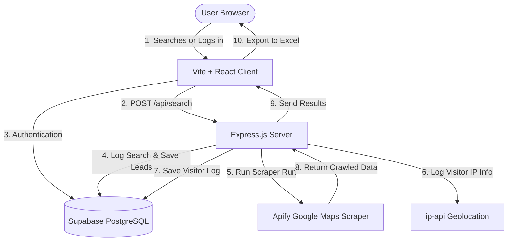

# 🚀 LeadFinder — Google Maps Lead Scraper & CRM

[](https://reactjs.org/)
[](https://nodejs.org/)
[](https://expressjs.com/)
[](https://supabase.com/)
[](https://apify.com/)
[](https://console.cloud.google.com/)

**LeadFinder** is a modern, high-performance, full-stack B2B lead generation tool that scrapes real-time business leads from Google Maps using **Apify**, enriches them with contact details, social links, and ratings, and automatically stores them in a **Supabase** database. Users can search by industry category and city, authenticate securely using **Google OAuth**, and export curated leads into custom-designed Excel sheets with dynamic summary dashboards.

---

## ✨ Features

*   🔍 **Real-Time Map Scraping:** Instantly fetches live business listings directly from Google Maps (powered by the reliable `compass/crawler-google-places` actor on Apify).
*   🌐 **Social & Contact Enrichment:** Automatically extracts phone numbers, websites, and social media handles (Facebook, Instagram, LinkedIn) from business profiles.
*   🔒 **Google OAuth Authentication:** Restricts full contact details and export functionalities to authenticated users, protecting scraping credits.
*   📊 **Beautiful Multi-Sheet Excel Export:** Generates structured `.xlsx` workbooks containing a curated leads sheet (with auto-fitting column widths) and an interactive Summary Dashboard sheet with aggregated lead metrics.
*   👥 **Visitor & Search Analytics:** Logs visitor geolocations (via IP geolocation integration) and search keywords to Supabase in the background.
*   ⚡ **Modern Responsive UI:** Features a sleek, modern visual design with loading animations, user feedback overlays, and a glassmorphism dashboard layout.

---

## 🏗️ System Architecture



---

## 🛠️ Technology Stack

### Frontend
*   **Vite + React.js** — Ultra-fast frontend bundler and reactive component structure.
*   **Google OAuth 2.0** — Safe client-side authentication library.
*   **Axios** — HTTP client for backend queries.
*   **Vanilla CSS** — Custom premium styling.

### Backend
*   **Node.js & Express.js** — Light, asynchronous backend routing.
*   **Supabase JS Client** — Connects directly to PostgreSQL database.
*   **Axios & Rate Limiters** — Handles API requests and secures endpoint endpoints.
*   **XLSX (SheetJS)** — Compiles and builds complex binary Excel workbooks dynamically.

---

## ⚙️ Local Development Setup

### Prerequisites
Make sure you have [Node.js](https://nodejs.org/) installed (v16.x or higher recommended).

---

### Step 1: Set up the Supabase Database
1.  Go to [Supabase](https://supabase.com/) and create a new project.
2.  Navigate to the **SQL Editor** in the left menu.
3.  Click **New query**.
4.  Copy the entire content of the [SUPABASE_SCHEMA.sql](file:///c:/Users/hardi/Coding%20All%20Programs/LEAD_SCRAPPER_CLAUDE/SUPABASE_SCHEMA.sql) file from this repository and paste it into the editor.
5.  Click the **Run** button (green) to create the `searches`, `leads`, and `visitors` tables, along with search indexes and Row Level Security (RLS) policies.

---

### Step 2: Configure Environment Variables

Create or update your `.env` configuration files.

#### Backend Env (`backend/.env`)
Create a file at `backend/.env` containing:
```env
PORT=5000

# Apify API Token (https://console.apify.com/account/integrations)
APIFY_API_TOKEN=your_apify_api_token_here

# Supabase Credentials (Settings -> API)
# IMPORTANT: DO NOT add a trailing '/rest/v1/' to the SUPABASE_URL
SUPABASE_URL=https://your-project-id.supabase.co
SUPABASE_ANON_KEY=your_supabase_anon_public_key_here

# Frontend URL (for CORS allowance)
FRONTEND_URL=http://localhost:5173
```

#### Frontend Env (`frontend/.env`)
Create a file at `frontend/.env` containing:
```env
VITE_API_URL=http://localhost:5000
# Google Client ID (https://console.cloud.google.com -> Credentials)
VITE_GOOGLE_CLIENT_ID=your_google_oauth_client_id.apps.googleusercontent.com
```
*Note: In Google Cloud Console, ensure you add `http://localhost:5173` to **Authorized JavaScript origins** and **Authorized redirect URIs**.*

---

### Step 3: Run the Application

#### Start the Backend Server
```bash
cd backend
npm install
npm start
```
The server will boot on `http://localhost:5000` and output validation checks showing whether your API tokens are correctly set up.

#### Start the Frontend Client
```bash
cd ../frontend
npm install
npm run dev
```
Open your browser and navigate to `http://localhost:5173`.

---

## 🗄️ Database Schema Details

The SQL script creates three tables:
1.  `searches`: Records user search parameters (keyword, city), client IP, matching results count, and timestamps for usage tracking.
2.  `leads`: Stores the fetched business profile data (name, address, phone number, rating, social handles, and Google Maps URL).
3.  `visitors`: Tracks active website visits, pulling client IP, user agent, city, country, and region using free IP geolocation services on search endpoints.

---

## 🌐 Production Deployment

### Backend Deployment (e.g., Railway, Render, Heroku)
1.  Create a project on your hosting provider of choice and hook it up to your GitHub repository (point root directory to `backend`).
2.  Add the environment variables in the dashboard:
    *   `APIFY_API_TOKEN`
    *   `SUPABASE_URL`
    *   `SUPABASE_ANON_KEY`
    *   `FRONTEND_URL` (Set this to your live production frontend URL)
3.  Your service will generate a public domain (e.g., `https://leadfinder-backend.onrender.com`).

### Frontend Deployment (e.g., Vercel, Netlify, Cloudflare Pages)
1.  Create a deployment linked to the `frontend` subfolder.
2.  Add the environment variables:
    *   `VITE_API_URL` (Set this to your newly deployed backend URL)
    *   `VITE_GOOGLE_CLIENT_ID` (Your Google OAuth client ID)
3.  Add the production URL (e.g., `https://leadfinder.vercel.app`) to your Google Cloud Console's OAuth Credentials whitelist under **Authorized JavaScript origins**.

---

## 📄 License
This project is licensed under the MIT License - see the LICENSE file for details.
