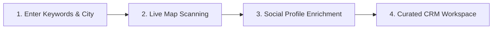

# 🚀 LeadFinder — B2B Lead Generator & CRM

LeadFinder is a premium, full-stack intelligence tool designed to scan, extract, and organize high-quality business leads in India. By pulling live data directly from Google Maps and enriching it with contact details and social media profiles, LeadFinder connects you instantly to potential business partners.

---

## 🔍 How It Works

LeadFinder simplifies B2B lead generation into a seamless, interactive workflow:

### 1. Simple Target Search
Enter what you are looking for (e.g., *Doctors, Plumbers, Barbers, Developers*) and the city in India you want to target (e.g., *Mumbai, Pune, Nagpur, Akola*).

### 2. Live Scraper Run
Once triggered, the backend spins up a live scraper to compile active business records from Google Maps in real-time. A live status console keeps you updated at every step of the crawl.

### 3. Contact & Social Enrichment
The system parses business profiles to extract verified phone numbers, website links, and social media pages (including Instagram handles, LinkedIn profiles, and Facebook links).

### 4. Interactive CRM Dashboard
Your results are populated in a beautiful card grid layout where you can instantly:
*   Copy contact lists to your clipboard.
*   Initiate instant WhatsApp chats with one click.
*   Bookmark/Star leads to build your custom prospect list.
*   Export the entire list into formatted Excel workbooks complete with an auto-calculated summary dashboard.

---

## 💎 Core Features

### 📡 Real-Time Map Crawler
Fetches live business listings directly from Google Maps, ensuring you are outreach-ready with real-time data instead of outdated static lists.

### 🌐 Social Handle Extraction
Ditches manual searching by automatically scouring the web to pull Instagram, LinkedIn, and Facebook profiles associated with the business, giving you multiple channels for contact.

### 🔒 Secure Access & Account Protection
Includes clean, fast Google Sign-In authentication. Contact numbers, addresses, and Excel export actions are securely kept locked for signed-in accounts to prevent public misuse and protect scraper limits.

### 📊 Beautiful Excel Exporter
Generates customized `.xlsx` workbooks featuring:
1.  **Leads Sheet:** A clean, formatted grid of all names, numbers, addresses, websites, and socials with automatically adjusted column widths.
2.  **Summary Dashboard Sheet:** An elegant, visually mapped summary displaying total leads, categories, average review ratings, and a breakdown of lead quality metrics.

### ⚡ Smart Search Cache
If a specific search in a city has been requested within the last 24 hours, LeadFinder bypasses the scraping wait time and serves it instantly from local storage, giving you rapid access to recently pulled records.

### 📱 Perfect Mobile Viewports
A layout with dynamic glassmorphism aesthetics optimized to adjust smoothly onto mobile phone screens, enabling you to hunt leads and trigger outreach on the go.

### 📈 Admin Analytics Dashboard
A private administration overview displaying statistics on search volume, active visits, popular industry searches, and target cities to track user trends.
